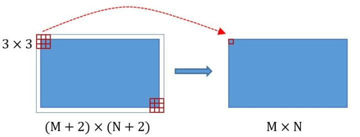
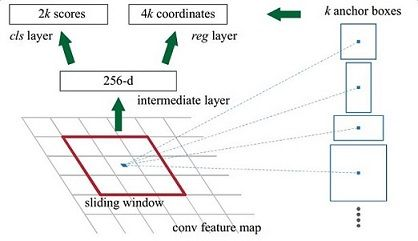
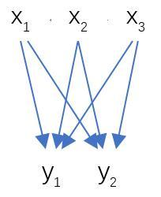
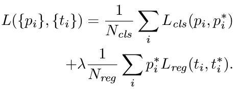

# Object detection

[TOC]

## 一、基本概念

### I.NMS

**NMS（non maximum suppression）**，中文名非极大值抑制，在很多计算机视觉任务中都有广泛应用，如：边缘检测、目标检测等。这里主要以人脸检测中的应用为例，来说明NMS。

**人脸检测的一些概念**

（1）绝大部分人脸检测器的核心是分类器，即给定一个尺寸固定图片，分类器判断是或者不是人脸；

（2）将分类器进化为检测器的关键是：在原始图像上从多个尺度产生窗口，并resize到固定尺寸，然后送给分类器做判断。最常用的方法是滑动窗口。

以下图为例，由于滑动窗口，同一个人可能有好几个框(每一个框都带有一个分类器得分)

而我们的目标是一个人只保留一个最优的框：

**于是我们就要用到非极大值抑制，来抑制那些冗余的框：** 抑制的过程是一个迭代-遍历-消除的过程。

（1）将所有框的得分排序，选中最高分及其对应的框：

（2）遍历其余的框，如果和当前最高分框的重叠面积(IOU)大于一定阈值，我们就将框删除。

（3）从未处理的框中继续选一个得分最高的，重复上述过程。

参考：[NMS——非极大值抑制](http://blog.csdn.net/shuzfan/article/details/52711706)

mensaochun注：NMS只是对同一个类别的物体做的，不会对不同类别的物体做。

### II.映射

首先，要明白卷积网络的感受野是怎么计算的，参考文章：[卷积神经网络中的感受野计算（译）](https://zhuanlan.zhihu.com/p/26663577)

本文翻译自[A guide to receptive field arithmetic for Convolutional Neural Networks](https://link.zhihu.com/?target=https%3A//medium.com/%40nikasa1889/a-guide-to-receptive-field-arithmetic-for-convolutional-neural-networks-e0f514068807)（可能需要翻墙才能访问），方便自己学习和参考。若有侵权，还请告知。

感受野（receptive field）可能是卷积神经网络（Convolutional Neural Network，CNNs）中最重要的概念之一，值得我们关注和学习。当前流行的物体识别方法的架构大都围绕感受野的设计。但是，当前并没有关于CNN感受野计算和可视化的完整指南。本教程拟填补空白，介绍CNN中特征图的可视化方法，从而揭示感受野的原理以及任意CNN架构中感受野的计算。我们还提供了代码实现证明计算的正确性，这样大家可以从感受野的计算开始研究CNN，从而更加深刻的理解CNN的架构。

本文假设读者已经熟悉CNN的思想，特别是卷积（convolutional）和池化（pooling）操作，当然你可以参考[[1603.07285\] A guide to convolution arithmetic for deep learning](https://link.zhihu.com/?target=https%3A//arxiv.org/abs/1603.07285)，回顾CNN的相关知识。如果你对CNNs已经有所了解，相信不超过半个小时就可以完成本文的阅读。实际上，本文受上述论文的启发，文中也采用了相似的表示符号。

**The fixed-sized CNN feature map visualization**

图1 CNN特征图可视化的两种方式。

如图1所示，我们采用卷积核C的核大小（kernel size）k=3*3，填充大小（padding size）p=1*1，步长（stride）s=2*2。（图中上面一行）对5*5的输入特征图进行卷积生成3*3的绿色特征图。（图中下面一行）对上面绿色的特征图采用相同的卷积操作生成2*2的橙色特征图。（图中左边一列）按列可视化CNN特征图，如果只看特征图，我们无法得知特征的位置（即感受野的中心位置）和区域大小（即感受野的大小），而且无法深入了解CNN中的感受野信息。（图中右边一列）CNN特征图的大小固定，其特征位置即感受野的中心位置。

感受野表示输入空间中一个特定CNN特征的范围区域（*The receptive field is defined as the region in the input space that a particular CNN’s feature is looking at）*。一个特征的感受野可以采用区域的中心位置和特征大小进行描述。图1展示了一些感受野的例子，采用核大小（kernel size）k=3*3，填充大小（padding size）p=1*1，步长（stride）s=2*2的卷积核C对5*5大小的输入图进行卷积操作，将输出3*3大小的特征图（绿色图）。对3*3大小的特征图进行相同的卷积操作，将输出2*2的特征图（橙色）。输出特征图在每个维度上的大小可以采用下面的公式进行计算（[[1603.07285\] A guide to convolution arithmetic for deep learning](https://link.zhihu.com/?target=https%3A//arxiv.org/abs/1603.07285)）：

为了简单，本文假设CNN的架构是对称的，而且输入图像长宽比为1，因此所有维度上的变量值都相同。若CNN架构或者输入图像不是对称的，你也可以分别计算每个维度上的特征图大小。如图1所示，左边一列展示了一种CNN特征图的常见可视化方式。这种可视化方式能够获取特征图的个数，但无法计算特征的位置（感受野的中心位置）和区域大小（感受野尺寸）。图1右边一列展示了一种固定大小的CNN特征图可视化方式，通过保持所有特征图大小和输入图大小相同来解决上述问题，接下来每个特征位于其感受野的中心。由于特征图中所有特征的感受野尺寸相同，我们就可以非常方便画出特征对应的包围盒（bounding box）来表示感受野的大小。因为特征图大小和输入图像相同，所以我们无需将包围盒映射到输入层。

图2 另外一种固定大小的CNN特征图表示。采用相同的卷积核C对7*7大小的输入图进行卷积操作，这里在特征中心周围画出了感受野的包围盒。为了表达更清楚，这里忽略了周围的填充像素。固定尺寸的CNN特征图可以采用3D（左图）或2D（右图）进行表示。

图2展示了另外一个例子，采用相同的卷积核C对7*7大小的输入图进行卷积操作。这里给出了3D（左图）和2D（右图）表示下的固定尺寸CNN特征图。注意：图2中感受野尺寸逐渐扩大，第二个特征层的中心特征感受野很快就会覆盖整个输入图。这一点对于CNN设计架构的性能提升非常重要。

**感受野的计算（Receptive Field Arithmetic）**

除了每个维度上特征图的个数，还需要计算每一层的感受野大小，因此我们需要了解每一层的额外信息，包括：当前感受野的尺寸**r**，相邻特征之间的距离（或者jump）**j**，左上角（起始）特征的中心坐标*start*，其中特征的中心坐标定义为其感受野的中心坐标（如上述固定大小CNN特征图所述）。假设卷积核大小**k**，填充大小**p**，步长大小**s**，则其输出层的相关属性计算如下：

- 公式一基于输入特征个数和卷积相关属性计算输出特征的个数
- 公式二计算输出特征图的**\*jump***，等于输入图的jump与输入特征个数（执行卷积操作时jump的个数，stride的大小）的乘积
- 公式三计算输出特征图的receptive field size，等于k个输入特征覆盖区域加上边界上输入特征的感受野覆盖的附加区域。
- 公式四计算第一个输出特征的感受野的中心位置，等于第一个输入特征的中心位置，加上第一个输入特征位置到第一个卷积核中心位置的距离，再减去填充区域大小。注意：这里都需要乘上输入特征图的jump，从而获取实际距离或间隔。

图3 对图1中的例子执行感受野计算。第一行给出一些符号和等式；第二行和最后一行说明给定输入层信息下输出层感受野的计算过程。

CNN的第一层是输入层，**n = image size，r = 1，j = 1，start = 0.5**。图3采用的坐标系中输入层的第一个特征中心位置在0.5。递归执行上述四个公式，就可以计算CNN中所有特征图中的感受野信息。图3给出这些公式计算的样例。

这里给出一个python小程序，用于计算给定CNN架构下所有层的感受野信息。程序允许输入任何特征图的名称和图中特征的索引号，输出相关感受野的尺寸和位置。图4给出AlexNet下的例子。

图4 AlexNet下感受野计算样例

~~~python
# [filter size, stride, padding]
#Assume the two dimensions are the same
#Each kernel requires the following parameters:
# - k_i: kernel size
# - s_i: stride
# - p_i: padding (if padding is uneven, right padding will higher than left padding; "SAME" option in tensorflow)
# 
#Each layer i requires the following parameters to be fully represented: 
# - n_i: number of feature (data layer has n_1 = imagesize )
# - j_i: distance (projected to image pixel distance) between center of two adjacent features
# - r_i: receptive field of a feature in layer i
# - start_i: position of the first feature's receptive field in layer i (idx start from 0, negative means the center fall into padding)

import math
convnet =   [[11,4,0],[3,2,0],[5,1,2],[3,2,0],[3,1,1],[3,1,1],[3,1,1],[3,2,0],[6,1,0], [1, 1, 0]]
layer_names = ['conv1','pool1','conv2','pool2','conv3','conv4','conv5','pool5','fc6-conv', 'fc7-conv']
imsize = 227

def outFromIn(conv, layerIn):
  n_in = layerIn[0]
  j_in = layerIn[1]
  r_in = layerIn[2]
  start_in = layerIn[3]
  k = conv[0]
  s = conv[1]
  p = conv[2]
  
  n_out = math.floor((n_in - k + 2*p)/s) + 1
  actualP = (n_out-1)*s - n_in + k 
  pR = math.ceil(actualP/2)
  pL = math.floor(actualP/2)
  
  j_out = j_in * s
  r_out = r_in + (k - 1)*j_in
  start_out = start_in + ((k-1)/2 - pL)*j_in
  return n_out, j_out, r_out, start_out
  
def printLayer(layer, layer_name):
  print(layer_name + ":")
  print("\t n features: %s \n \t jump: %s \n \t receptive size: %s \t start: %s " % (layer[0], layer[1], layer[2], layer[3]))
 
layerInfos = []
if __name__ == '__main__':
#first layer is the data layer (image) with n_0 = image size; j_0 = 1; r_0 = 1; and start_0 = 0.5
  print ("-------Net summary------")
  currentLayer = [imsize, 1, 1, 0.5]
  printLayer(currentLayer, "input image")
  for i in range(len(convnet)):
    currentLayer = outFromIn(convnet[i], currentLayer)
    layerInfos.append(currentLayer)
    printLayer(currentLayer, layer_names[i])
  print ("------------------------")
  layer_name = raw_input ("Layer name where the feature in: ")
  layer_idx = layer_names.index(layer_name)
  idx_x = int(raw_input ("index of the feature in x dimension (from 0)"))
  idx_y = int(raw_input ("index of the feature in y dimension (from 0)"))
  
  n = layerInfos[layer_idx][0]
  j = layerInfos[layer_idx][1]
  r = layerInfos[layer_idx][2]
  start = layerInfos[layer_idx][3]
  assert(idx_x < n)
  assert(idx_y < n)
  
  print ("receptive field: (%s, %s)" % (r, r))
  print ("center: (%s, %s)" % (start+idx_x*j, start+idx_y*j))
~~~

## 二、Faster RCNN

笔记源自于[一文读懂Faster R-CNN](https://zhuanlan.zhihu.com/p/31426458)，做了略微的修改。

​	经过R-CNN和Fast R-CNN的积淀，Ross B. Girshick在2016年提出了新的Faster R-CNN，在结构上，Faster R-CNN已经将特征抽取(feature extraction)，proposal提取，bounding box regression(rect refine)，classification都整合在了一个网络中，使得综合性能有较大提高，在检测速度方面尤为明显。

依作者看来，如图1，Faster R-CNN其实可以分为4个主要内容：

1. Conv layers。作为一种CNN网络目标检测方法，Faster R-CNN首先使用一组基础的conv+relu+pooling层提取image的feature maps。该feature maps被共享用于后续RPN层和全连接层。
2. Region Proposal Networks。RPN网络用于生成region proposals。该层通过softmax判断anchors属于foreground或者background，再利用bounding box regression修正anchors获得精确的proposals。
3. Roi Pooling。该层收集输入的feature maps和proposals，综合这些信息后提取proposal feature maps，送入后续全连接层判定目标类别。
4. Classification。利用proposal feature maps计算proposal的类别，同时再次bounding box regression获得检测框最终的精确位置。

所以本文以上述4个内容作为切入点介绍Faster R-CNN网络。

​	图2 faster_rcnn_test.pt网络结构 （pascal_voc/VGG16/faster_rcnn_alt_opt/faster_rcnn_test.pt）

​	图2展示了python版本中的VGG16模型中的faster_rcnn_test.pt的网络结构，可以清晰的看到该网络对于一副任意大小PxQ的图像，首先缩放至固定大小MxN，然后将MxN图像送入网络；而Conv layers中包含了13个conv层+13个relu层+4个pooling层；RPN网络首先经过3x3卷积，再分别生成foreground anchors与bounding box regression偏移量，然后计算出proposals；而Roi Pooling层则利用proposals从feature maps中提取proposal feature送入后续全连接和softmax网络作classification（即分类proposal到底是什么object）。

### I.Conv layers

​	Conv layers包含了conv，pooling，relu三种层。如图2，Conv layers部分共有13个conv层，13个relu层，4个pooling层。这里有一个非常容易被忽略但是又无比重要的信息，在Conv layers中：

1. 所有的conv层都是：kernel_size=3，pad=1
2. 所有的pooling层都是：kernel_size=2，stride=2

  ​为何重要？在Faster RCNN Conv layers中对所有的卷积都做了扩边处理（pad=1，即填充一圈0），导致原图变为(M+2)x(N+2)大小，再做3x3卷积后输出MxN。正是这种设置，导致Conv layers中的conv层不改变输入和输出矩阵大小。如图3：

$$
图3
$$
​	

类似的是，Conv layers中的pooling层kernel_size=2，stride=2。这样每个经过pooling层的MxN矩阵，都会变为(M/2)*(N/2)大小。综上所述，在整个Conv layers中，conv和relu层不改变输入输出大小，只有pooling层使输出长宽都变为输入的1/2。那么，一个MxN大小的矩阵经过Conv layers固定变为(M/16)x(N/16)！这样Conv layers生成的featuure map中都可以和原图对应起来。

### II.Region proposal network(RPN)

$$
图4
$$
​	上图4展示了RPN网络的具体结构。可以看到RPN网络实际分为2条线，上面一条通过softmax分类anchors获得foreground和background（检测目标是foreground），下面一条用于计算对于anchors的bounding box regression偏移量，以获得精确的proposal。而最后的Proposal层则负责综合foreground anchors和bounding box regression偏移量获取proposals，同时**剔除太小和超出边界**的proposals。其实整个网络到了Proposal Layer这里，就完成了相当于目标定位的功能。

#### 1.Anchors

​	提到RPN网络，就不能不说anchors。所谓anchors，实际上就是一组由rpn/generate_anchors.py生成的矩形。直接运行作者demo中的generate_anchors.py可以得到以下输出：

~~~python
[[ -84.  -40.   99.   55.]
 [-176.  -88.  191.  103.]
 [-360. -184.  375.  199.]
 [ -56.  -56.   71.   71.]
 [-120. -120.  135.  135.]
 [-248. -248.  263.  263.]
 [ -36.  -80.   51.   95.]
 [ -80. -168.   95.  183.]
 [-168. -344.  183.  359.]]
~~~

​	其中每行的4个值[x1,y1,x2,y2]代表矩形左上和右下角点坐标。9个矩形共有3种形状，长宽比为大约为：width:height = [1:1, 1:2, 2:1]三种，如图6。实际上通过anchors就引入了检测中常用到的多尺度方法。

​	注：关于上面的anchors size，其实是根据检测图像设置的。在python demo中，会把任意大小的输入图像reshape成800x600（即图2中的M=800，N=600）。再回头来看anchors的大小，anchors中长宽1:2中最大为352x704，长宽2:1中最大736x384，基本是cover了800x600的各个尺度和形状。

​	那么这9个anchors是做什么的呢？借用Faster RCNN论文中的原图，如图7，**遍历Conv layers计算获得的feature maps，为每一个点都配备这9种anchors作为初始的检测框。**这样做获得检测框很不准确，不用担心，后面还有2次bounding box regression可以修正检测框位置。

解释一下上面这张图的数字。

1. 在原文中使用的是ZF model中，其Conv Layers中最后的conv5层num_output=256，对应生成256张特征图，所以相当于feature map每个点都是256-dimensions
2. 在conv5之后，做了rpn_conv/3x3卷积且num_output=256，相当于每个点又融合了周围3x3的空间信息（猜测这样做也许更鲁棒？反正我没测试），同时256-d不变（如图4和图7中的红框）
3. 假设在conv5 feature map中每个点上有k个anchor（默认k=9），而每个anhcor要分foreground和background，所以每个点由256d feature转化为cls=2k scores；而每个anchor都有[x, y, w, h]对应4个偏移量，所以reg=4k coordinates
4. 补充一点，全部anchors拿去训练太多了，训练程序会在合适的anchors中**随机**选取128个postive anchors+128个negative anchors进行训练（什么是合适的anchors下文5.1有解释）

注意，在本文讲解中使用的VGG conv5 num_output=512，所以是512d，其他类似.....

#### 2.Softmax判定foreground与background

​	一副MxN大小的矩阵送入Faster RCNN网络后，到RPN网络变为(M/16)x(N/16)，不妨设W=M/16，H=N/16。在进入reshape与softmax之前，先做了1x1卷积，如图8：

​	该1x1卷积的caffe prototxt定义如下：

~~~protobuf
layer {
  name: "rpn_cls_score"
  type: "Convolution"
  bottom: "rpn/output"
  top: "rpn_cls_score"
  convolution_param {
    num_output: 18   # 2(bg/fg) * 9(anchors)
    kernel_size: 1 pad: 0 stride: 1
  }
}
~~~

​	可以看到其num_output=18，也就是经过该卷积的输出图像为WxHx18大小（注意第二章开头提到的卷积计算方式）。这也就刚好对应了feature maps每一个点都有9个anchors，同时每个anchors又有可能是foreground和background，所有这些信息都保存WxHx(9x2)大小的矩阵。为何这样做？后面接softmax分类获得foreground anchors，也就相当于初步提取了检测目标候选区域box（一般认为目标在foreground anchors中）。

​	那么为何要在softmax前后都接一个reshape layer？其实只是为了便于softmax分类，至于具体原因这就要从caffe的实现形式说起了。在caffe基本数据结构blob中以如下形式保存数据：

~~~yaml
blob=[batch_size, channel，height，width]
~~~

​	对应至上面的保存bg/fg anchors的矩阵，其在caffe blob中的存储形式为[1, 2*9, H, W]。而在softmax分类时需要进行fg/bg二分类，所以reshape layer会将其变为[1, 2, 9*H, W]大小，即单独“腾空”出来一个维度以便softmax分类，之后再reshape回复原状。贴一段caffe softmax_loss_layer.cpp的reshape函数的解释，非常精辟：

~~~protobuf
"Number of labels must match number of predictions; "
"e.g., if softmax axis == 1 and prediction shape is (N, C, H, W), "
"label count (number of labels) must be N*H*W, "
"with integer values in {0, 1, ..., C-1}.";
~~~

​	综上所述，RPN网络中利用anchors和softmax初步提取出foreground anchors作为候选区域。

#### 3.Bounding box regression原理

​	介绍bounding box regression数学模型及原理。如图9所示绿色框为飞机的Ground Truth(GT)，红色为提取的foreground anchors，那么即便红色的框被分类器识别为飞机，但是由于红色的框定位不准，这张图相当于没有正确的检测出飞机。所以我们希望采用一种方法对红色的框进行微调，使得foreground anchors和GT更加接近。

​	对于窗口一般使用四维向量(x, y, w, h)表示，分别表示窗口的中心点坐标和宽高。对于图 10，红色的框A代表原始的Foreground Anchors，绿色的框G代表目标的GT，我们的目标是寻找一种关系，使得输入原始的anchor A经过映射得到一个跟真实窗口G更接近的回归窗口G'，即：

- 先做平移

  

- 再做缩放

  

  ​观察上面4个公式发现，需要学习的是$d_{x}(A),d_{y}(A),d_{w}(A),d_{h}(A)$这四个变换。当输入的anchor A与GT相差较小时，可以认为这种变换是一种线性变换， 那么就可以用线性回归来建模对窗口进行微调（注意，只有当anchors A和GT比较接近时，才能使用线性回归模型，否则就是复杂的非线性问题了）。

  ​接下来的问题就是如何通过线性回归获得 $d_{x}(A),d_{y}(A),d_{w}(A),d_{h}(A) $ 了。线性回归就是给定输入的特征向量X, 学习一组参数W, 使得经过线性回归后的值跟真实值Y非常接近，即$Y=WX$。对于该问题，输入X是一张经过卷积获得的feature map，定义为Φ；同时还有训练传入的GT，即$t_{x}, t_{y}, t_{w}, t_{h}$。输出是$d_{x}(A),d_{y}(A),d_{w}(A),d_{h}(A)$四个变换。那么目标函数可以表示为：

​	其中Φ(A)是对应anchor的feature map组成的特征向量，w是需要学习的参数，d(A)是得到的预测值（*表示 x，y，w，h，也就是每一个变换对应一个上述目标函数）。为了让预测值$t_{x}, t_{y}, t_{w}, t_{h}$与真实值差距最小，设计损失函数：

​	函数优化目标为：

​	需要说明，只有在GT与需要回归框位置比较接近时，才可近似认为上述线性变换成立。

说完原理，对应于Faster RCNN原文，foreground anchor与ground truth之间的平移量 $(t_x, t_y)$ 与尺度因子 $(t_w, t_h) $如下：

​	对于训练bouding box regression网络回归分支，输入是cnn feature Φ，监督信号是Anchor与GT的差距 $(t_x, t_y, t_w, t_h)$，即训练目标是：输入 Φ的情况下使网络输出与监督信号尽可能接近。

​	那么当bouding box regression工作时，再输入Φ时，回归网络分支的输出就是每个Anchor的平移量和变换尺度 $(t_x, t_y, t_w, t_h)$，显然即可用来修正Anchor位置了。

#### 4. 对Proposals进行bounding box regression

​	在了解bounding box regression后，再回头来看RPN网络第二条线路，如图11

~~~protobuf
layer {
  name: "rpn_bbox_pred"
  type: "Convolution"
  bottom: "rpn/output"
  top: "rpn_bbox_pred"
  convolution_param {
    num_output: 36   # 4 * 9(anchors)
    kernel_size: 1 pad: 0 stride: 1
  }
}
~~~

可以看到其num_output=36，即经过该卷积输出图像为WxHx36，在caffe blob存储为[1, 36, H, W]，这里相当于feature maps每个点都有9个anchors，每个anchors又都有4个用于回归的$d_{x}(A),d_{y}(A),d_{w}(A),d_{h}(A)$变换量。

#### 5.Proposal layer

​	Proposal Layer负责综合所有 $d_{x}(A),d_{y}(A),d_{w}(A),d_{h}(A)$变换量和foreground anchors，计算出精准的proposal，送入后续RoI Pooling Layer。还是先来看看Proposal Layer的caffe prototxt定义：

~~~protobuf
layer {
  name: 'proposal'
  type: 'Python'
  bottom: 'rpn_cls_prob_reshape'
  bottom: 'rpn_bbox_pred'
  bottom: 'im_info'
  top: 'rois'
  python_param {
    module: 'rpn.proposal_layer'
    layer: 'ProposalLayer'
    param_str: "'feat_stride': 16"
  }
}
~~~

​	Proposal Layer有3个输入：fg/bg anchors分类器结果rpn_cls_prob_reshape，对应的bbox reg的$d_{x}(A),d_{y}(A),d_{w}(A),d_{h}(A)$变换量rpn_bbox_pred，以及im_info；另外还有参数feat_stride=16，这和图4是对应的。

​	首先解释im_info。对于一副任意大小PxQ图像，传入Faster RCNN前首先reshape到固定MxN，im_info=[M, N, scale_factor]则保存了此次缩放的所有信息。然后经过Conv Layers，经过4次pooling变为WxH=(M/16)x(N/16)大小，其中feature_stride=16则保存了该信息，用于计算anchor偏移量。

Proposal Layer forward（caffe layer的前传函数）按照以下顺序依次处理：

1. 生成anchors，利用$d_{x}(A),d_{y}(A),d_{w}(A),d_{h}(A)$对所有的anchors做bbox regression回归（这里的anchors生成和训练时完全一致）
2. 按照输入的foreground softmax scores由大到小排序anchors，提取前pre_nms_topN(e.g. 6000)个anchors，即提取**修正位置后**的foreground anchors。
3. 限定超出图像边界的foreground anchors为图像边界（防止后续roi pooling时proposal超出图像边界）
4. 剔除非常小（width<threshold or height<threshold）的foreground anchors
5. 进行nonmaximum suppression
6. 再次按照nms后的foreground softmax scores由大到小排序fg anchors，提取前post_nms_topN(e.g. 300)结果作为proposal输出。

  ​之后输出proposal=[x1, y1, x2, y2]，注意，由于在第三步中将anchors映射回原图判断是否超出边界，**所以这里输出的proposal是对应MxN输入图像尺度的**，这点在后续网络中有用。另外我认为，严格意义上的检测应该到此就结束了，后续部分应该属于识别了~

RPN网络结构就介绍到这里，总结起来就是：

生成anchors -> softmax分类器提取fg anchors -> bbox reg回归fg anchors -> Proposal Layer生成proposals

**mensaochun注：注意proposal是对应原图的，不是对应feature map的，因此得到proposal之后，要将其转为到feature map中的proposal，再将其喂给ROI pooling进行进一步的操作！**

### III.ROI Pooling

​	而RoI Pooling层则负责收集proposal，并计算出proposal feature maps，送入后续网络。从图2中可以看到Rol pooling层有2个输入：

1. 原始的feature maps
2. RPN输出的proposal boxes（大小各不相同）

#### 1.为何需要RoI Pooling

​	先来看一个问题：对于传统的CNN（如AlexNet，VGG），当网络训练好后输入的图像尺寸必须是固定值，同时网络输出也是固定大小的vector or matrix。如果输入图像大小不定，这个问题就变得比较麻烦。有2种解决办法：

1. 从图像中crop一部分传入网络
2. 将图像warp成需要的大小后传入网络

​	两种办法的示意图如图13，可以看到无论采取那种办法都不好，要么crop后破坏了图像的完整结构，要么warp破坏了图像原始形状信息。

​	回忆RPN网络生成的proposals的方法：对foreground anchors进行bounding box regression，那么这样获得的proposals也是大小形状各不相同，即也存在上述问题。所以Faster R-CNN中提出了RoI Pooling解决这个问题。

​	不过RoI Pooling确实是从[Spatial Pyramid Pooling](https://link.zhihu.com/?target=https%3A//arxiv.org/abs/1406.4729)发展而来，但是限于篇幅这里略去不讲，有兴趣的读者可以自行查阅相关论文。

#### 2.RoI Pooling原理

分析之前先来看看RoI Pooling Layer的caffe prototxt的定义： 

~~~protobuf
layer {
  name: "roi_pool5"
  type: "ROIPooling"
  bottom: "conv5_3"
  bottom: "rois"
  top: "pool5"
  roi_pooling_param {
    pooled_w: 7
    pooled_h: 7
    spatial_scale: 0.0625 # 1/16
  }
}
~~~

​	RoI Pooling layer forward过程：在之前有明确提到：proposal=[x1, y1, x2, y2]是对应MxN尺度的，所以首先使用spatial_scale参数将其映射回(M/16)x(N/16)大小的feature maps尺度；之后将每个proposal水平和竖直分为pooled_w和pooled_h份，对每一份都进行max pooling处理。这样处理后，即使大小不同的proposal，输出结果都是7x7大小，实现了fixed-length output（固定长度输出）。

### VI.Classification

​	Classification部分利用已经获得的proposal feature maps，通过full connect层与softmax计算每个proposal具体属于那个类别（如人，车，电视等），输出cls_prob概率向量；同时再次利用bounding box regression获得每个proposal的位置偏移量bbox_pred，用于回归更加精确的目标检测框。Classification部分网络结构如图15。

从PoI Pooling获取到7x7=49大小的proposal feature maps后，送入后续网络，可以看到做了如下2件事：

1. 通过全连接和softmax对proposals进行分类，这实际上已经是识别的范畴了
2. 再次对proposals进行bounding box regression，获取更高精度的rect box

这里来看看全连接层InnerProduct layers，简单的示意图如图16，

其计算公式如下：

​	其中W和bias B都是预先训练好的，即大小是固定的，当然输入X和输出Y也就是固定大小。所以，这也就印证了之前Roi Pooling的必要性。到这里，我想其他内容已经很容易理解，不在赘述了

### V.训练

​	Faster R-CNN的训练，是在已经训练好的model（如VGG_CNN_M_1024，VGG，ZF）的基础上继续进行训练。实际中训练过程分为6个步骤：

1. 在已经训练好的model上，训练RPN网络，对应stage1_rpn_train.pt

2. 利用步骤1中训练好的RPN网络，收集proposals，对应rpn_test.pt

3. 第一次训练Fast RCNN网络，对应stage1_fast_rcnn_train.pt

4. 第二训练RPN网络，对应stage2_rpn_train.pt

5. 再次利用步骤4中训练好的RPN网络，收集proposals，对应rpn_test.pt

6. 第二次训练Fast RCNN网络，对应stage2_fast_rcnn_train.pt

​        可以看到训练过程类似于一种“迭代”的过程，不过只循环了2次。至于只循环了2次的原因是应为作者提到："A similar alternating training can be run for more iterations, but we have observed negligible improvements"，即循环更多次没有提升了。接下来本章以上述6个步骤讲解训练过程。

mensaochun注：注意RPN网络和fast RCNN网络是共享conv层的，所以需要进行迭代训练。每次训练，conv层的权重都有更新。

#### 1.训练RPN网络

​	在该步骤中，首先读取RBG提供的预训练好的model（本文使用VGG），开始迭代训练。来看看stage1_rpn_train.pt网络结构，如图17。

​	图17 stage1_rpn_train.pt（考虑图片大小，Conv Layers中所有的层都画在一起了，如红圈所示，后续图都如此处理）

与检测网络类似的是，依然使用Conv Layers提取feature maps。整个网络使用的Loss如下：

​	上述公式中，i表示anchors index， $p_{i}$ 表示foreground softmax predict概率，$p_{i}^{*}$代表对应的GT predict概率（即当第i个anchor与GT间IoU>0.7，认为是该anchor是foreground，$p_{i}^{*}=1$；反之IoU<0.3时，认为是该anchor是background，$p_{i}^{*}=0$；至于那些0.3<IoU<0.7的anchor则不参与训练）；$t$代表predict bounding box，$t^{*}代$表对应foreground anchor对应的GT box。可以看到，整个Loss分为2部分：

1. cls loss，即rpn_cls_loss层计算的softmax loss，用于分类anchors为forground与background的网络训练
2. reg loss，即rpn_loss_bbox层计算的soomth L1 loss，用于bounding box regression网络训练。注意在该loss中乘了$p_{i}^{*}$，相当于只关心foreground anchors的回归（其实在回归中也完全没必要去关心background）。

  ​由于在实际过程中，$N_{cls}$差距过大，用参数λ平衡二者（如$N_{cls}$=256，$N_{reg}$=2400时设置λ=10），使总的网络Loss计算过程中能够均匀考虑2种Loss。这里比较重要是Lreg使用的soomth L1 loss，计算公式如下：

​	了解数学原理后，反过来看图17：

1. 在RPN训练阶段，rpn-data（python AnchorTargetLayer）层会按照和test阶段Proposal层完全一样的方式生成Anchors用于训练

2. 对于rpn_loss_cls，输入的rpn_cls_scors_reshape和rpn_labels分别对应$p$与$p^{*}$ ，Ncls参数隐含在$p$与$p^{*}$的caffe blob的大小中

3. 对于rpn_loss_bbox，输入的rpn_bbox_pred和rpn_bbox_targets分别对应$t$于$t^{*}$，rpn_bbox_inside_weigths对应$p^{*}$，rpn_bbox_outside_weigths未用到（从soomth_L1_Loss layer代码中可以看到），而Nreg同样隐含在caffe blob大小中。

​	这样，公式与代码就完全对应了。特别需要注意的是，在训练和检测阶段生成和存储anchors的顺序完全一样，这样训练结果才能被用于检测！

#### 2 通过训练好的RPN网络收集proposals

​	在该步骤中，利用之前的RPN网络，获取proposal rois，同时获取foreground softmax probability，如图18，然后将获取的信息保存在python pickle文件中。该网络本质上和检测中的RPN网络一样，没有什么区别。

#### 3.训练Faster RCNN网络

读取之前保存的pickle文件，获取proposals与foreground probability。从data层输入网络。然后：

1. 将提取的proposals作为rois传入网络，如图19蓝框
2. 计算bbox_inside_weights+bbox_outside_weights，作用与RPN一样，传入soomth_L1_loss layer，如图19绿框

这样就可以训练最后的识别softmax与最终的bounding box regression了，如图19。

之后的stage2训练都是大同小异，不再赘述了。

Faster R-CNN还有一种end-to-end的训练方式，可以一次完成train，有兴趣请自己看作者GitHub吧。

